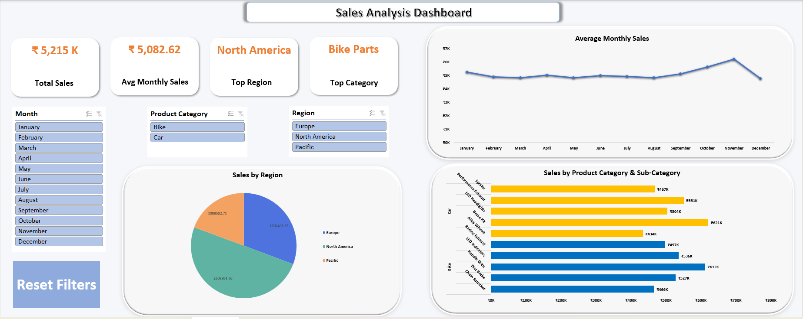

# 📊 Sales Analysis Dashboard (Microsoft Excel)

---

## 📌 Project Overview
This project showcases an **interactive Sales Analysis Dashboard** built using **Microsoft Excel** to analyze sales data.  
The dashboard transforms raw sales data into actionable business insights through **dynamic KPI cards, pivot-based visualizations, interactive slicers, and VBA automation**.

---

## 🖼 Dashboard Preview

## 🎯 Project Objective
1. Design a business-ready interactive dashboard in Excel
2. Provide quick and meaningful sales insights using KPIs
3. Enable dynamic filtering using slicers
4. Automate repetitive actions using VBA macros
5. Demonstrate strong Excel dashboarding and reporting skills

---

## 🛠️ Tools & Technologies
- Microsoft Excel  
- Pivot Tables  
- Pivot Charts  
- Slicers  
- KPI Cards  
- VBA (Macros)

---

## ⚙️ Key Features
**📌 1. KPI Cards** - KPI cards provide a quick snapshot of business performance:
- Total Sales
- Average Monthly Sales
- Top Performing Region
- Top Product Category    

**🎛 2. Interactive Slicers** - Dynamic filtering is enabled using slicers for:
- Month
- Region
- Product Category

   ✔ All slicers are connected to relevant Pivot Tables and charts to ensure consistent filtering.

**📊 3. Pivot-Based Visualizations** - The dashboard includes the following charts:
  - Line Chart – Monthly Sales Trend
  - Bar Chart – Sales by Product Category & Subcategory
  - Column Chart – Total Sales by Region

      Each visualization is designed for clarity, readability, and business relevance.
  
**🔁 4. VBA Automation – Reset Filters Button** - A Reset Filters button was created using a VBA macro to:
  - Clear all slicer selections
  - Refresh all Pivot Tables  
  
    This improves usability by allowing users to instantly return to the default dashboard view.

 ⚠️ **Note:** Please **enable macros** when opening the Excel file to use this functionality.

---

## 📈 Insights Enabled
- Identified high-performing regions and product categories 
- Analyzed monthly sales trends and seasonal patterns 
- Compared regional sales contribution to overall revenue 
- Evaluated category and subcategory sales performance  

---

## 📂 Files Included
- **Sales_Analysis_Dashboard.xlsm**  
  Macro-enabled Excel dashboard with Pivot Tables, Pivot Charts, slicers, KPI cards, and VBA automation  

- **Dashboard_Preview.png**  
  Image preview of the completed Sales Analysis Dashboard
  
- **README.md**  
  Project documentation outlining objectives, features, tools used, and dashboard overview

---

## 🚀 Future Scope
- Profitability & Margin Analysis
Add Cost, Profit, and Profit Margin KPIs to evaluate not just sales performance but overall business profitability.
 
- Target vs Actual Performance Tracking
Introduce sales targets and variance analysis to highlight underperforming and overperforming regions or categories.
  
- Customer & Segment Insights
Analyze customer behavior by identifying repeat customers, high-value segments, and regional buying patterns

- Automated Data Refresh with Power Query
Enable automatic data loading and transformation from external data sources for scalable, real-world usage.

- Migration to Power BI for Enterprise Scalability
Rebuild the dashboard in Power BI to support real-time updates, cloud sharing, and advanced analytics.

---

## 👤 Author
**Sanjana Sankpal**  
Entry-Level Data Analyst | Excel • SQL • Power BI  

**Technical Skills:**  
Microsoft Excel • Pivot Tables • Pivot Charts • Slicers • Dashboards • Data Analysis • Data Visualization
